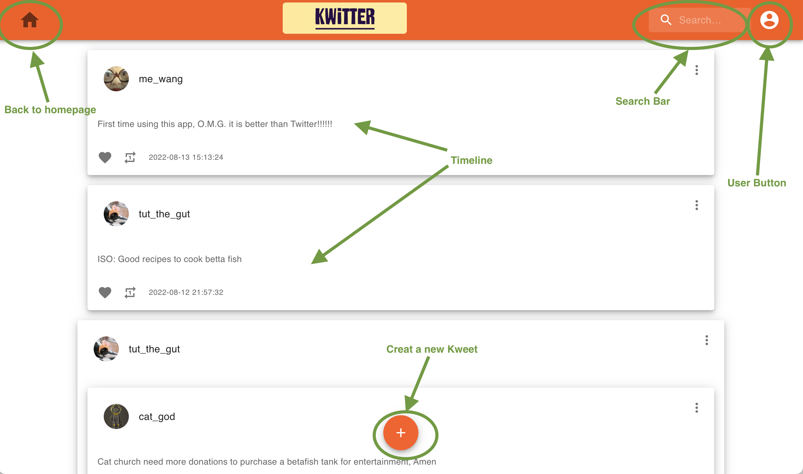
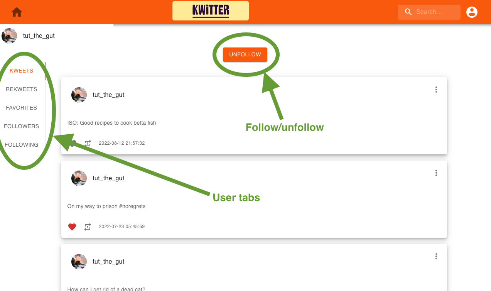
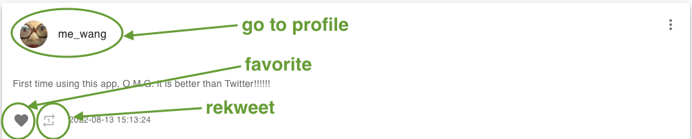

# Kwitter

A social media clone using MySQL/NodeJS/React.

  
  
  

# Installation

To install the Kwitter app locally, first clone the project into a directory on your machine.

`git clone https://github.com/mwgiannini/Kwitter.git`

  

To run the React server, open a terminal in the /kwitter-app/ directory and run the following commands

```

npm i

npm start

```

  

To run the Node backend server, open a terminal in the /kwitter-server/ directory and run the same commands

```

npm i

npm start

```

  

To run the mySQL server, load the latest Dump file from the /kwitter-db/Dumps/ directory into mySQL workbench using the [server-> data import]

  **Make sure that the HOST variable in kwitter-app/src/APIclient.tsx is set to localhost**
  
  **Once all three servers are running, you can continue on to use the app @ http://localhost:3000**
  
  
  

# Using the app

  Using the app is simple. Some data has already been stored in the database for demonstration.
>USER LOGINS

|username|  password|
|--|--|
| mw | murphy |
|me_wang|vesper|
|frank|123456|
|tut_the_gut|password|
|humphrey_dumpty|drowssap|
|cat_god|catRulesTheWorld|

## Sign in /Sign up

  

Upon the page load, if you have not logged in, then the page will direct you to the log in page. To create an account, click the signup button. Alternatively, the accounts above have posts, follows, 'rekweets', and likes already made.

Tip *the user mw has the best data for demo purposes*

<pre>

</pre>


## Navbar
The home icon on the navbar will bring you back to your timeline from any page.  

The search bar can be used to find users to interact with. Try searching for the users in the table above!

The user button will display the current user and a logout button when clicked.

Tip: *click any user's name or profile picture to view that user's page.*

<pre>

</pre>


## Timeline
After logging in, you will be directed to your timeline. The timeline is a collection of all the posts and reposts of the users you are following in chronological order. Your posts will also appear on this screen.

From this page, you can also write your first Kweet! Click the plus icon on the bottom of the page to begin writing.

## User page
The user page displays a user's posts, reposts, favorites, followers,  and followings. 

On other's user pages, you can follow or unfollow the user with the button at the top of the screen

<pre>

</pre>


## Kweets
You can favorite/unfavorite other's kweets with the heart icon.

You can repost/unrepost other's kweets with the arrow icon next to the favorite button.

If a kweet is yours, you may delete it with the trash icon.

Tip: *Your favorites and rekweets are public and visible on your user page.*

<pre>

</pre>

