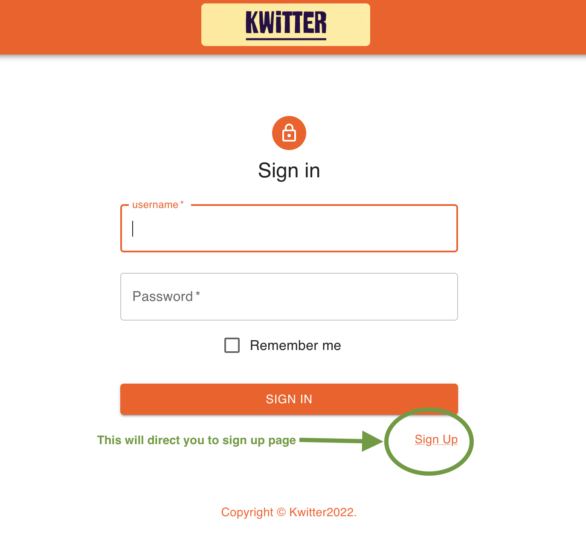

# Kwitter

A social media clone using MySQL/NodeJS/React.

  
  
  

# Installation

To install the Kwitter app locally, first clone the project into a directory on your machine.

`git clone https://github.com/mwgiannini/Kwitter.git`

  

To run the React server, open a terminal in the /kwitter-app/ directory and run the following commands

```

npm i

npm start

```

  

To run the Node backend server, open a terminal in the /kwitter-server/ directory and run the same commands

```

npm i

npm start

```

  

To run the mySQL server, load the latest Dump file from the /kwitter-db/Dumps/ directory into mySQL workbench using the [server-> data import]

  
  
  **Once all three servers are running, you can continue on to use the app @ http://localhost:3000**
  
  
  

# Using the app

  Using the app is simple. Some data has already been stored in the database for demonstration.
>USER LOGINS

|username|  password|
|--|--|
| mw | murphy |
|amor|vesper|
|frank|123456|
|tut_the_gut|password|
|humphrey_dumpty|drowssap|
|cat_god|catRulesTheWorld|

## Sign in /Sign up

  

Upon the page load, if you have not logged in, then the page will direct you to the log in page. To create an account, click the signup button. Alternatively, log in the accounts above have posts, follows, 'rekweets', and likes already made.

<pre>

</pre>

